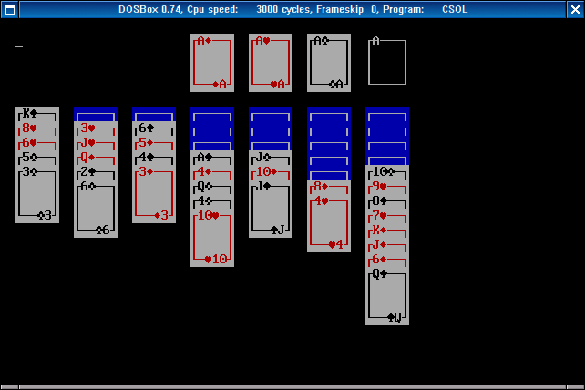

# csol (DOS version)

A port of [csol](https://github.com/nielssp/csol) for DOS.

Can be compiled using:
- [pdcurses](https://pdcurses.sourceforge.io/)
- [Open Watcom](http://www.openwatcom.org/)

## Compiling using DOSBox

- Download and unpack the csol-dos sources
- Create a `lib` directory in the root of the source tree
- Download the PDCurses source from https://github.com/wmcbrine/PDCurses/releases and unpack to `lib/pdcurses`
- Download the installer for Open Watcom C/C++ for DOS from http://www.openwatcom.org/download.php into the `lib` directory
- Start dosbox in the root of the csol-dos source tree (e.g. run `dosbox .`)
- Go to the directory containing the Open Watcom installer: `cd lib`
- Run the installer, e.g. `open-w~1.exe`
- When asked for the install path, type `C:\LIB\WATCOM`
- Finish the installation using the default settings.
- The installer creates an `AUTOEXEC.BAT` file that sets up the correct environment. It should look like this:

        PATH C:\LIB\WATCOM\BINW;%PATH%;
        SET INCLUDE=C:\LIB\WATCOM\H;
        SET WATCOM=C:\LIB\WATCOM
        SET EDPATH=C:\LIB\WATCOM\EDDAT
        SET WIPFC=C:\LIB\WATCOM\WIPFC

- Run it: `..\AUTOEXEC.BAT`
- Then go to the directory containing the DOS makefiles for PDCurses: `CD PDCURSES\DOS`
- Compile PDCurses: `wmake -f Makefile.wcc`
- Go back to the root of the csol-dos source tree: `cd \`
- Compile csol: `wmake`
- You can now run csol from the current directory: `csol`

## Configuration, games, themes and controls

See [csol](https://github.com/nielssp/csol).

Only the single letter command line flags can be used.
